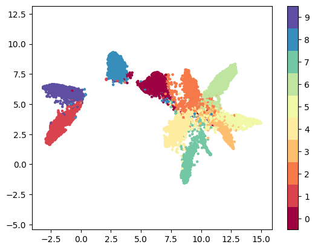

# Studying the impact of magnitude pruning on contrastive learning methods 

We study the impact of different versions of [magnitude pruning](https://arxiv.org/pdf/1710.01878.pdf) on the representation learned by deep models trained with Supervised and [Supervised Contrastive](https://arxiv.org/pdf/2004.11362.pdf) learning methods. We discover that at high sparsity contrastive learning results in a higher number of misclassified examples than if the models are trained with supervised learning. We use the number of [PIEs](https://arxiv.org/pdf/1911.05248.pdf) (Hooker et al., 2019), [Q Score](https://arxiv.org/pdf/2203.01881.pdf) (Kalibhat et al., 2022), and [PD-Score](https://arxiv.org/pdf/2106.09647.pdf) (Baldock et al., 2021) metrics to understand the impact of pruning on the learned representation quality. Our analysis suggests that popular pruning methods are oblivious to representation learning: misclassified examples are largely unique for a combination of learning and pruning methods. The negative impact of sparsity on the quality of the learned representation is the highest early on in the training phase.


## Software prerequisites 
Install the software packages required for reproducing the experiment by running the command: `pip3 install -r requirements.txt` inside the project folder. 

Run the `setup.sh` script file to create the hierarchy of folders used to store the plots and the logs file of the experiment.


Download the pre-trained models from the zipped 'models.zip' folder (TO BE RELEASED) and store them in the main folder. 

## Running 
For each program, the flag `--cuda_device GPU_ID` is used to specify on which GPU the code will be run. The commands used to reproduce the results reported in the paper are stated below. 

**Contrastive Learning PIEs detection**
```
python3.7 clr_pie_kmodels_detection.py 
```

**Supervised Learning PIEs detection**
```
python3.7 sup_pie_kmodels_detection.py
```
To compute the UMAP visualization of the hidden representations produced by the encoder network add the flag `--plot_umap` followed by `--models_number 1`  . 

The plots will be stored in the `pies/cifar10/SupCon/umap` (or `pies/cifar10/supervised/umap`) folders. To compute the Q-Score add the flag `--plot_q_score` without changing the `--models_number` parameter. 

**Contrastive Learning Prediction Depth**
```
python3.7 clr_prediction_depth.py 
```

**Supervised Learning Prediction Depth**
```
python3.7 sup_prediction_depth.py
```

The plots will be stored in the `pies/cifar10/SupCon/prediction_depth` (or `pies/cifar10/supervised/prediction_depth`) folder. The flag `--prediction_depth_models` is used to set up the number of the encoder networks used to compute the prediction depth score for each sample. 

## Training 
All the models trained will be stored inside the `models/` main folder. 

**Contrastive Learning Training**
```
python3.7 clr_training.py.py 
```

**Supervised Learning Training**
```
python3.7 sup_training.py 
```

The training hyperparameters can be specified by passing them as arguments to the code. The Supervised code will serialize the trained model as a single `.pt` file while the Supervised Contrastive will produce two `.pt` files (one for the Encoder and one for the Classification head). 

**Supervised Learning Finetune**
```
python3.7 sup_pruning_finetune.py
```

**Supervised Contrastive Learning Finetune**
```
python3.7 clr_pruning_finetune.py
```

The finetune code will load 30 models not-pruned and will apply One-Shot global pruning followed by finetuning. The models finetuned will be stored in the `models` folder. 

## UMAP Visualization 

**(1) UMAP Supervised Learning 0% sparsity and 95% sparsity (One-Shot pruning)**

 

**(2) UMAP Supervised Contrastive Learning 0% sparsity and 95% sparsity (One-Shot pruning)**

 

The article produced (available [here](https://arxiv.org/pdf/2207.00200.pdf)) was accepted at the [Hardware Aware Efficient Training](https://haet2022.github.io/) ICML2022 Workshop. 

## BibTeX

If you found this repository useful, please consider citing our work.
```
@article{corti2022studying,
  title={Studying the impact of magnitude pruning on contrastive learning methods},
  author={Corti, Francesco and Entezari, Rahim and Hooker, Sara and Bacciu, Davide and Saukh, Olga},
  journal={arXiv preprint arXiv:2207.00200},
  year={2022}
}
```
